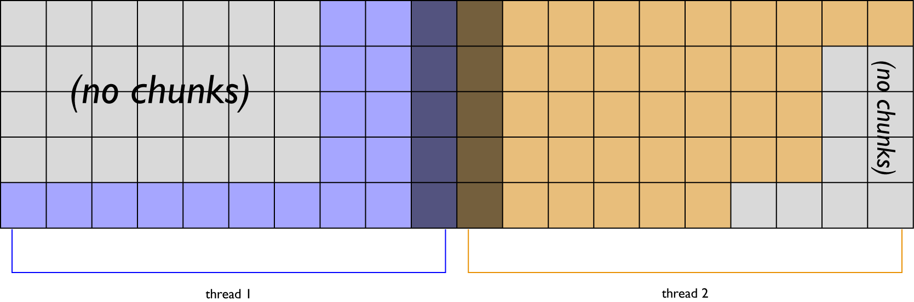
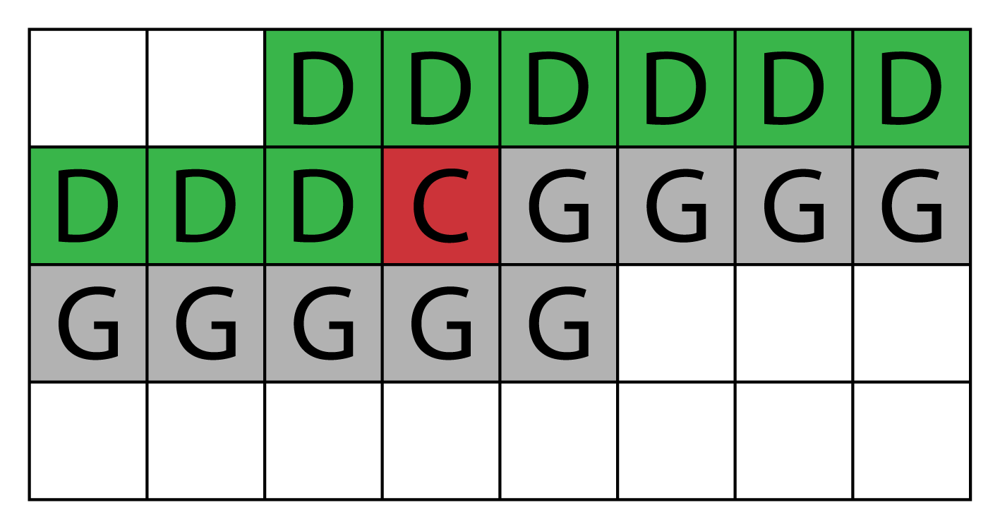
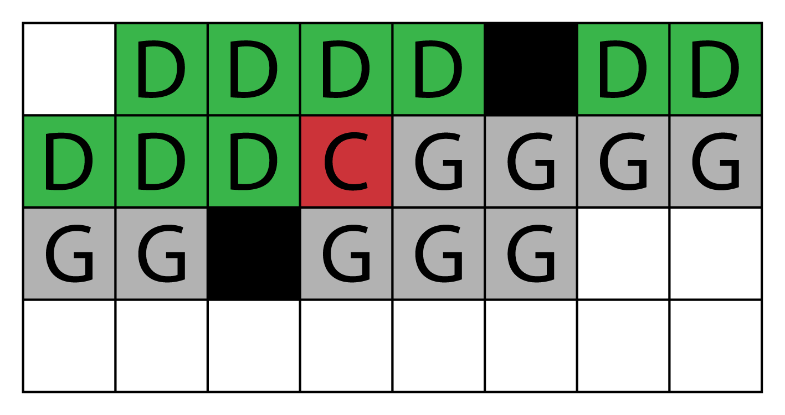

# Disasterclass: Multicore dispatch process #

This document describes the algorithm _Disasterclass_ runs to run some function over a world's chunks deterministically, while efficiently using all available CPU cores.

This document is focused on the mathematics underlying the implementation, and won't delve too deeply into the Disasterclass source code. It assumes the reader is familiar with the internal structure of a Minecraft world — the terms _region_, _chunk_ and _section_ should ring a bell — as well as how the X, Y and Z dimensions map to a world.

## Requirements ##

Disasterclass uses a model of worker threads and message passing to process a world in parallel. It's designed against the following constraints:

1. Must run on (theoretically) infinite CPU cores. (The implementation caps it at `<world-width> / 3`, for reasons explained below.)
2. Each chunk in the world must be the focus of a function iteration exactly once.
3. Each chunk must be able to see the eight chunks immediately surrounding it, with this neighbour radius able to increase in future.
4. Each chunk must be able to remain ignorant of region boundaries.

## What Disasterclass does ##

Let's take these points in order. To run the process on any number of cores, we can simply split the world into equal-width strips. For reasons that'll become clearer later, we split the world widthways only, with dividing lines running north to south. This gives us an intuitive sense of how the iteration divides up:

Let's call each of these parts _rations_. (Don't worry about the darker squares for now.)

Now what about ensuring the chunk can access its neighbours? Well, first it's worth looking at how _Minecraft_ serialises its 3D and 2D arrays. Every byte array representing some element of a chunk's 16 × 256 × 16 cuboid orders its elements YZX. Index `[0]` maps to block `[0, 0, 0]`. Stepping through the array brings us to `[15, 0, 0]`, then it wraps round to `[0, 0, 1]`. After `[15, 0, 15]`, we have `[0, 1, 0]`, until we reach the last element at `[65535]` → `[15, 255, 15]`. Similarly, two-dimensional arrays are ordered ZX.

Disasterclass repeats this explicit iteration order, and considers a ZX-ordered iteration to be the canonical order. While chunk filtering functions are told not to rely on this, it is an explicit part of the process described here.

We can use that to deal with the radius condition by iterating through our ration with a sliding window big enough to ensure that these eight chunks are always somewhere in the window:

The _current chunk_ (represented by the red **C**) is currently the focus of the iteration. The _leading chunks_ (**D**) are north-west of the current chunk, and have already been processed. The _lagging chunks_ (**G**) have been unserialised into the worker thread, and have yet to be the centre of the function. As iteration moves on to the next chunk (the **G** immediately to the right), the north-west-most **D** is serialised back to file, the previous **C** becomes a **D**, and a new **G** is added to the south-east end of the window.

This works even if some chunks don't exist; it just means that the worker thread holds on to more chunks than it strictly needs to:

Because Disasterclass doesn't create or destroy chunks, some chunks might be missing some neighbours. Functions have to accept this as a given.

Mathematically, the sliding window size for each half is `(<ration-width> + 1) × <radius-required>`. Note that the implementation currently keeps leading and lagging chunks in separate arrays.

All good, right? Well, there's one more thing to take care of. See the darker squares in the first image? They can't become the current chunk because three of their neighbours aren't available. This happens with chunks on the western and eastern edges of rations that border other rations, and there's nothing we can do about it at this stage. Instead, after these rations have been iterated through, we create a new set of rations, each containing those two columns of darkened chunks and their neighbours. (The neighbours are there because they have to be, and are never promoted to role of current chunk. See rule 2.)

Incidentally, this is why we only split the world in one direction. If we split it in two, the areas we'd have to iterate over in this second phase wouldn't be separate strips, but interlocking cross-hatches. And that would just be awful to try and do.

## Caveats ##

The implementation of the algorithm isn't perfect. It currently has these niggles:

* All rations must be at least 3 chunks wide. For very narrow worlds, the implementation should instead defer to a single-core algorithm.

* The split points are equidistant over the world's <abbr title="Axis-Aligned Bounding Box">AABB</abbr>, and some threads are bound to end up with more chunks to process than others. The more jagged the world's west/east edges are, the more of a problem this is.

* The implementation currently sets no maximum width on the rations, which can cause high memory usage in very wide worlds (where `eastern edge − western edge = a big number`), since the sliding window has to span this at least twice. Ideally, there should be a maximum width based on projected memory usage
imposed on rations, with some rations being run later on freed threads if needs be.

###_fin_###

Simon Harris, 2013-08-12 
`simon [at] pearfalse [dot] co [dot] uk`
